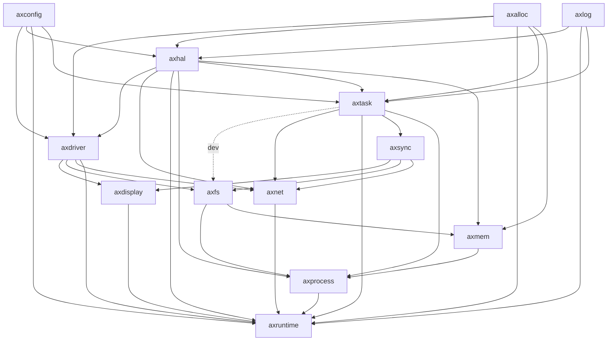

# 代码组织
此部分主要说明LA架构的相关代码，其他主要的代码说明可参照在线文档：[Starry (azure-stars.github.io)](https://azure-stars.github.io/Starry/)

### 整体结构图


### 代码目录
如下所示：

```text
├── build_img.sh
├── Cargo.lock
├── Cargo.toml
├── crates
│   ├── kernel_guard
│        │   ├── Cargo.toml
│        │   ├── README.md
│        │   └── src
│        │       ├── arch
│        │       │   ├── aarch64.rs
│        │       │   ├── loongarch64.rs （开关中断使能实现）
│        │       │   ├── mod.rs
│        │       │   ├── riscv.rs
│        │       │   └── x86.rs
│        │       └── lib.rs
│        ├── page_table
│        │   ├── Cargo.toml
│        │   └── src
│        │       ├── arch
│        │       │    ├── aarch64.rs
│        │       │    ├── loongarch64.rs
│        │       │    ├── mod.rs
│        │       │    ├── riscv.rs
│        │       │    └── x86_64.rs
│        │       ├── bits64.rs
│        │       └── lib.rs
│        ├── page_table_entry
│        │   ├── Cargo.toml
│        │   └── src
│        │       ├── arch
│        │       │    ├── aarch64.rs
│        │       │    ├── loongarch64.rs （相关页表的具体实现）
│        │       │    ├── mod.rs
│        │       │    ├── riscv.rs
│        │       │    └── x86_64.rs
│        │       └── lib.rs
├── modules
│   ├── axconfig
│   │    ├── build.rs
│   │    ├── Cargo.toml
│   │    ├── defconfig.toml
│   │    └── src
│   │        ├── config_dummy.rs
│   │        ├── config_pc_x86.rs
│   │        ├── config_qemu_virt_aarch64.rs
│   │        ├── config_qemu_virt_riscv.rs
│   │        ├── config_raspi4_aarch64.rs
│   │        └── lib.rs
│   ├── axhal
│        ├── build.rs
│        ├── Cargo.toml
│        ├── linker.lds.S
│        ├── linker_loongarch64-2k1000.lds    （链接脚本，构建时由cargo生成）
│        ├── linker_loongarch64-qemu-virt.lds
│        └── src
│            ├── arch
│            │    ├── aarch64
│            │    │    ├── context.rs
│            │    │    ├── mod.rs
│            │    │    ├── trap.rs
│            │    │    └── trap.S
│            │    ├── loongarch64       （架构相关，实现异常处理的事情，包括页表处理，缺页异常）
│            │    │    ├── context.rs   （上下文切换相关）
│            │    │    ├── mod.rs       （TLB初始化代码）
│            │    │    ├── trap.rs      （异常处理）
│            │    │    ├── trap.S
│            │    │    ├── unaligned.rs （非对齐处理代码）
│            │    │    └── unaligned.S
│            │    ├── mod.rs
│            │    ├── riscv
│            │    │    ├── context.rs
│            │    │    ├── macros.rs
│            │    │    ├── mod.rs
│            │    │    ├── trap.rs
│            │    │    └── trap.S
│            │    └── x86_64
│            │        ├── context.rs
│            │        ├── gdt.rs
│            │        ├── idt.rs
│            │        ├── mod.rs
│            │        ├── trap.rs
│            │        └── trap.S
│            ├── cpu.rs
│            ├── irq.rs
│            ├── lib.rs
│            ├── mem.rs
│            ├── paging.rs
│            ├── platform
│            │    ├── aarch64_bsta1000b
│            │    │    ├── dw_apb_uart.rs
│            │    │    ├── mem.rs
│            │    │    ├── misc.rs
│            │    │    ├── mod.rs
│            │    │    └── mp.rs
│            │    ├── aarch64_common
│            │    │    ├── boot.rs
│            │    │    ├── generic_timer.rs
│            │    │    ├── gic.rs
│            │    │    ├── mod.rs
│            │    │    ├── pl011.rs
│            │    │    └── psci.rs
│            │    ├── aarch64_qemu_virt
│            │    │    ├── mem.rs
│            │    │    ├── mod.rs
│            │    │    └── mp.rs
│            │    ├── aarch64_raspi
│            │    │    ├── mem.rs
│            │    │    ├── mod.rs
│            │    │    └── mp.rs
│            │    ├── dummy
│            │    │    └── mod.rs
│            │    ├── loongarch64_2k1000 （与2k1000开发板相关）
│            │    │    ├── boot.rs               （kernel入口函数，初始化）
│            │    │    ├── console.rs            （UART相关，putchar, getchar）
│            │    │    ├── irq.rs                （IRQ dispatch）
│            │    │    ├── mem.rs                （平台platform_regions）
│            │    │    ├── misc.rs               
│            │    │    ├── mod.rs                （从C到Rust环境入口）
│            │    │    ├── mp.rs                 （SMP相关实现） 
│            │    │    └── time.rs               （定时器相关代码）
│            │    ├── loongarch64_qemu_virt （与LA QEMU平台相关）
│            │    │    ├── boot.rs
│            │    │    ├── console.rs
│            │    │    ├── irq.rs
│            │    │    ├── mem.rs
│            │    │    ├── misc.rs
│            │    │    ├── mod.rs
│            │    │    ├── mp.rs
│            │    │    └── time.rs
│            │    ├── mod.rs
│            │    ├── riscv64_qemu_virt
│            │    │    ├── boot.rs
│            │    │    ├── console.rs
│            │    │    ├── irq.rs
│            │    │    ├── mem.rs
│            │    │    ├── misc.rs
│            │    │    ├── mod.rs
│            │    │    ├── mp.rs
│            │    │    └── time.rs
│            │    └── x86_pc
│            │         ├── apic.rs
│            │         ├── ap_start.S
│            │         ├── boot.rs
│            │         ├── dtables.rs
│            │         ├── mem.rs
│            │         ├── misc.rs
│            │         ├── mod.rs
│            │         ├── mp.rs
│            │         ├── multiboot.S
│            │         ├── time.rs
│            │         └── uart16550.rs
│            ├── time.rs
│            ├── tls.rs
│            └── trap.rs
├── platforms
│   ├── aarch64-bsta1000b.toml
│   ├── aarch64-qemu-virt.toml
│   ├── aarch64-raspi4.toml
│   ├── loongarch64-2k1000.toml         （平台配置信息，与地址空间设置）
│   ├── loongarch64-qemu-virt.toml
│   ├── riscv64-qemu-virt.toml
│   ├── x86_64-pc-oslab.toml
│   └── x86_64-qemu-q35.toml
├── README.md

``` 

### 模块依赖图



* crates：与OS设计无关的公共组件
* modules：与OS设计更加耦合的组件
* doc：每周汇报文档，当前位于doc分支上
* apps：unikernel架构下的用户程序，继承原有ArceOS
* scripts：makefile脚本，继承原有ArceOS
* ulib：用户库，继承原有ArceOS

